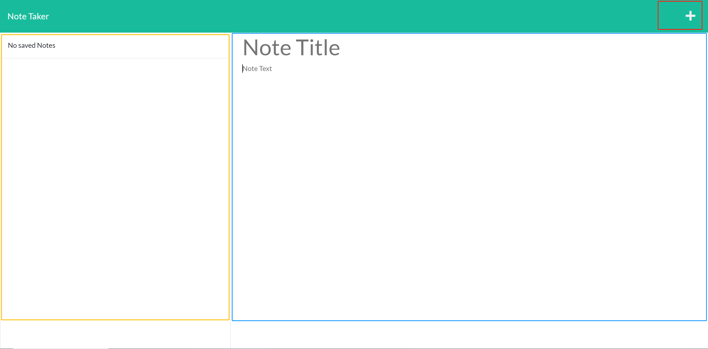
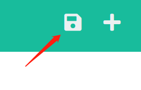

# Simple Notepad

## Description

This is a simple application to take notes. It is light weight and does not require any login. Mainly developed with Express.js.

## Installation

Simple notepad does not require any installaton.

[Click here](https://simple-notepad-for-everyone.herokuapp.com/) to nagivate to application main page.

## Usage

### Overview

> Once in main page, click `Get Started` button in the middle of the page to take notes.

> Here are the sections of the notes page.
>
> 
>
> Yellow section is the saved notes
>
> Blue section is the current note
>
> Red section is the utilities

### Save Note

> Click the `+` button in the utility section. Then input your title and content of your note in the current note section, and a save button will pop up.
>
> 
>
> Click the save button and your note will be saved to the saved notes section.

### View and Delete Notes

> Simply click on the note and your note will appear in the current note section.
>
> Delete the saved notes by click the delete button beside the note you want to delete.
>
> 

## Contribution

Pull requests are welcome. For major changes, please open an issue first to discuss what you would like to change.

## License

MIT License 

Copyright (c) 2022 hmhtom

Permission is hereby granted, free of charge, to any person obtaining a copy
of this software and associated documentation files (the "Software"), to deal
in the Software without restriction, including without limitation the rights
to use, copy, modify, merge, publish, distribute, sublicense, and/or sell
copies of the Software, and to permit persons to whom the Software is
furnished to do so, subject to the following conditions:

The above copyright notice and this permission notice shall be included in all
copies or substantial portions of the Software.

THE SOFTWARE IS PROVIDED "AS IS", WITHOUT WARRANTY OF ANY KIND, EXPRESS OR
IMPLIED, INCLUDING BUT NOT LIMITED TO THE WARRANTIES OF MERCHANTABILITY,
FITNESS FOR A PARTICULAR PURPOSE AND NONINFRINGEMENT. IN NO EVENT SHALL THE
AUTHORS OR COPYRIGHT HOLDERS BE LIABLE FOR ANY CLAIM, DAMAGES OR OTHER
LIABILITY, WHETHER IN AN ACTION OF CONTRACT, TORT OR OTHERWISE, ARISING FROM,
OUT OF OR IN CONNECTION WITH THE SOFTWARE OR THE USE OR OTHER DEALINGS IN THE
SOFTWARE.
